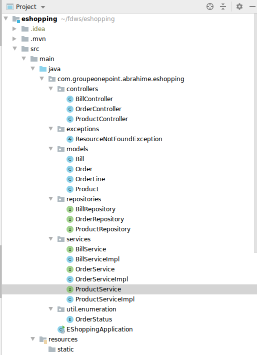

 
# EShopping API 
This is a small API for shopping site.

## Quick start
#### REST API
##### Using 

Java 11,Spring Boot , Hibernate, JPA specification and H2
 
## REST controllers
* **Product Controller**
    * Get all products `List<Product> getAllProduct()`;
    * Find product by ID `Product getProductById(long productId)`;
    * Add a product `Product createProduct(Product product)`;
    * Update a product `Product updateProduct(long id, Product product)`;
    * Delete a product `void delete(long id)`.
    * Sort products by weight `List<Product> getAllProductSortedByWeight()`;
    * Sort products by name `List<Product> getAllProductSortedByName()`;
    * Sort products by price `List<Product> getAllProductSortedByPrice()`;
    * Sort products with multiple fields `List<Product> getAllProductGroupBySort()`;
* **Order Controller**
    * 
 * **Bill Controller**
     * 
 
 
 #####(The documentation is not yet finished given the time constraint)
 ## Here is an overview of the project architecture
 

#### © GroupeOnePoint 2021